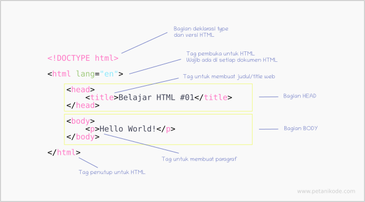
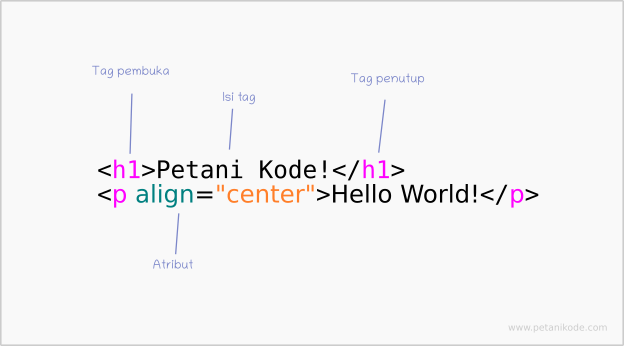

# HTML

**Hyper Text MarkUp Language** (HTML) adalah bahasa yang sering dipakai untuk membuat website. HTML ini adalah struktur dasar dan menjadi kerangka untuk sebuah website. HTML berisi element untuk bagian - bagian pada website.

Di bawah ini adalah struktur dasar dari HTML :

source:petanikode.com

Dari gambar diatas terlihat bahwa HTML terdiri dari element - element berupa tag. Isi dari website berada pada body. Banyak sekali elemen - elemen pada html, seperti p untuk paragraf, img untuk gambar h1 untuk judul atau header, dan masih banyak lagi.

source:petanikode.com

Gambar diatas adalah struktur dasar tag pada HTML. Untuk mempelajari lanjut HTML, banyak website yang membahas tutorial HTML, seperti di petanikode.com. Untuk mencari referensi tag pada HTML bisa diliat di w3schools.com.

Untuk lebih mudah dalam mengatur sebuah website, dibagi menjadi per divisi seperti contoh dibawah ini.

Sebelumnya, untuk membagi bagian - bagian website, pada HTML menggunakan div yang diberi class dengan nama sesuai bagiannya. Untuk HTML versi terbaru, yaitu 5 terdapat tag sendiri untuk setiap bagian. Tag untuk pembagian website sesuai dengan nama bagian tersebut seperti pada gambar, contohnya header, nav, footer, dan lain-lain.

Pembagian website akan memudahkan kita untuk mendesain website menggunakan CSS.

---

# CSS

**Cascading Style Sheet** (CSS) digunakan untuk tampilan pada website. CSS akan memperindah halaman pada website bersama dengan HTML. CSS berfungsi untuk mengatur halaman, font, warna, dan lain sebagainya untuk tampilan website.

Website without CSS :
.png)

Website with CSS :
.png)

Dalam penempatan kode CSS, dibagi menjadi 3, yaitu :

1. Inline CSS

   .png)
   Kode diatas adalah contoh penempatan CSS di dalam tag HTML. 

2. Internal CSS
 
   .png)
   Kode diatas adalah contoh penempatan CSS di bagian head.

3. Eksternal CSS
   
   .png)
   .png)
   Diatas adalah contoh kode CSS yang ditempatkan pada file yang berbeda. Kemudian dimasukkan ke dalam HTML dengan cara seperti pada gambar dua.

---

# JavaScript

JavaScript adalah bahasa pemrograman untuk web yang populer. Dengan javascript, website akan lebih interaktif. Javascript hampir sama seperti bahasa pemrograman lainnya. 

Sama seperti CSS, terdapat beberapa cara penempatan kode javascript, yaitu :

1. Menulis javascript pada tag script
   
   .png)
   .png)

   Tag script bisa ditempatkan pada head maupun body. Namun, penempatan lebih baik pada body dengan alasan pengeksekusiannya lebih cepat(sumber: petanikode.com).

   Contoh hasilnya :

   .png)
   .png)

2. Menulis javascript di eksternal file
   
   .png)
   Diatas adalah contoh penempatan javascript pada eksternal file dengan format file .js

3. Menulis javascript pada atribut HTML

   .png)
   Javascript juga dapat ditulis dalam atribut HTML seperti contoh diatas.

---

# Cookie

Cookie digunakan untuk menyimpan sebuah informasi oleh server sehingga ketika mengakses server tersebut, informasi tersebut dapat digunakan kembali. Seperti contoh, ketika login di suatu website, kemudian suatu hari login lagi, jika cookie diijinkan maka cookie dapat menyimpan akun dan langsung masuk ke situs website tersebut tanpa login lagi.

## CURL

Curl atau biasa disebut see(c) url adalah command pada linux yang digunakan untuk mengirim(POST) atau mengambil(GET) data pada website

Sintaks : curl [Options] [URL]

